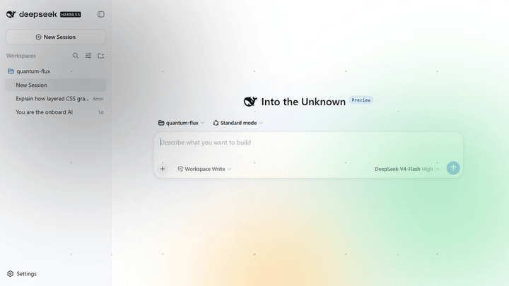
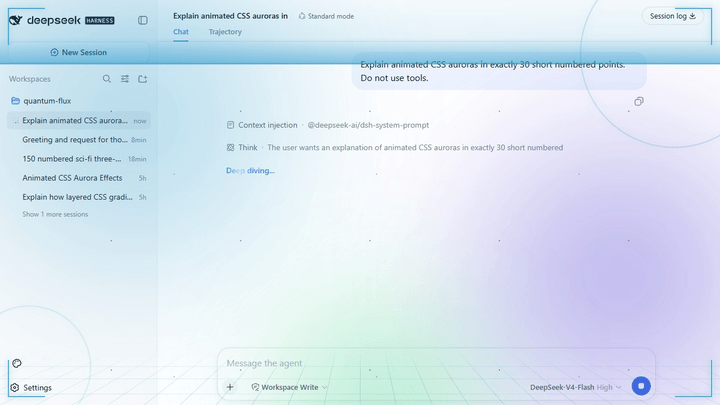

# dsh-vibe

[English](README.md) | 简体中文

> 为 [DeepSeek Harness](https://github.com/deepseek-ai/deepseek-harness) Web 界面增添沉浸式科幻氛围。

dsh-vibe 是一个同时包含 Host（主机端）和 Client（浏览器端）的 Cordis 插件，为 dsh Web 界面增加两层氛围效果：

1. **常驻背景** — 三团缓慢漂移、可适配主题的极光，以及深邃、缓慢滚动的星空。
2. **思考中 HUD** — 模型开始思考时，科幻叠加层会淡入：四个脉动角标、一束扫描能量光、两个旋转能量环，以及沿屏幕底部流动的合成波透视网格。响应完成或停止后，HUD 会卸载。

视觉效果使用 CSS 动画，并且完全不会拦截点击。侧边栏左下角的 Vibe 按钮可用于快速打开插件的外观设置。

### 环境背景

始终显示极光和星空的空闲 Harness 界面：



### 思考中 HUD

由真实模型响应触发的 HUD：



## 功能

| 层级                       | 效果                                              |
| -------------------------- | ------------------------------------------------- |
| 背景（始终显示）           | 3 团极光 · 漂移的双层星空                         |
| 思考中 HUD（响应运行期间） | 发光角标 · 扫描光束 · 2 个旋转能量环 · 合成波网格 |
| Vibe 设置                  | 氛围预设 · 自定义基础颜色 · 可选快捷按钮 · 重置   |

- **零交互干扰** — 每个效果层都使用 `pointer-events: none`，并针对 Shell 的叠加层 CSS 做了加固，因此绝不会阻挡点击。
- **适配主题** — Adaptive 使用 Harness 主题令牌；所有预设和控件在浅色与深色模式下都保持清晰可读。
- **配置简单** — 打开侧边栏左下角的 Vibe 按钮，即可切换预设或选择基础颜色。
- **HUD 即时响应** — 思考效果使用与侧边栏相同的 `useSessions` 运行状态，无需轮询。
- **自动保存** — 配置由 Harness Host 持久化，并会在你返回时自动恢复。
- **支持减少动态效果** — 当操作系统启用“减少动态效果”时，连续动画会停止。

## 要求

- [DeepSeek Harness](https://github.com/deepseek-ai/deepseek-harness) (dsh)，并运行 `web` 配置方案（profile）。
- Node 20+。
- `PATH` 中可以使用 `pnpm`（`dsh plugin` 命令使用它管理配置方案中的软件包）。

如果无法运行 `pnpm --version`，请先执行 `npm install --global pnpm` 安装。

### 兼容性

| Harness 版本 | 验证情况                                                                                |
| ------------ | --------------------------------------------------------------------------------------- |
| `0.1.0-rc.8` | 真实隔离界面：快捷面板、插件配置、持久化、主题、浅色/深色模式、侧边栏窄栏和移动端布局   |
| `0.1.1-rc.2` | 打包后的插件包 add/dump/remove 流程；已检查客户端模块加载器、`shell.overlay` 和运行状态 |

Harness 仍在快速演进。如果新版本更改了客户端协议，请提交 issue，并附上 Harness 版本和浏览器控制台输出。

## 安装

```sh
dsh plugin --profile web add dsh-vibe
```

该命令会从 npm 将 `dsh-vibe` 下载到 Web 配置方案（profile），并自动启用其插件包（bundle）。重启 `dsh web`，然后强制刷新页面（Ctrl+F5）。无需手动编辑 YAML。

## 更新

```sh
dsh plugin --profile web update dsh-vibe
```

更新后请重启 `dsh web`，然后强制刷新页面。

## 从手动安装迁移

如果你之前通过向 `$DSH_HOME/profiles/web/cordis.patch.yml` 添加 `dsh-vibe` 条目来安装旧版本，请在运行上面的安装命令**之前**删除该条目。插件包现在会自动提供这个条目；同时保留两份会重复插入同一个插件。

删除旧条目后，运行安装命令并重启 `dsh web`。

## 从 GitHub 安装最新源码（不使用 npm registry）

```sh
dsh plugin --profile web add github:unthropic/dsh-vibe
```

安装后请重启 `dsh web`。此方式仍然需要 `pnpm`，只会改变软件包的下载来源。

## 配置

点击侧边栏左下角的 **Vibe** 按钮可以快速切换氛围预设。相同的氛围预设控件以及快捷按钮开关也可以在 **Settings → Plugins → Plugin configuration → dsh-vibe** 中找到。

- **Adaptive** — 跟随当前 Harness 配色。
- **Ocean** — 使用冷色调的蓝色与青色配色。
- **Ember** — 使用暖色调的橙色与洋红色配色。
- **Custom** — 选择你自己的基础颜色。
- **显示浮动 Vibe 按钮（Show floating Vibe button）** — 隐藏或恢复快捷按钮；该开关始终可以在 Plugin configuration 中找到。
- **Reset** — 恢复默认的 Adaptive 预设。

更改会立即生效，并通过 Harness Host 保存。视觉效果会继续适配 Harness 的浅色和深色模式；当操作系统启用“减少动态效果”时，连续动画仍会停止。

## 开发

```sh
npm install
npm run check
```

运行 `npm run demos:render`，可以从真实运行、且已启用此插件的 DeepSeek Harness 界面录制 README 动画演示。默认地址为 `http://127.0.0.1:3081/`；可通过 `DSH_DEMO_URL` 指定其他地址。渲染器会打开隔离浏览器，确认 Harness 和插件均已加载，录制空闲背景，提交一条真实模型提示，仅在 Harness 报告该响应正在运行时录制 HUD，并在接受生成的 GIF 前完整解码所有帧。因此，所选模型提供商必须有足够额度完成一次响应。可通过 `DSH_DEMO_PROMPT` 替换默认录制提示。

## 卸载

```sh
dsh plugin --profile web remove dsh-vibe
```

卸载后请重启 `dsh web`。

## 许可证

[MIT](LICENSE) © 2026 Unthropic
